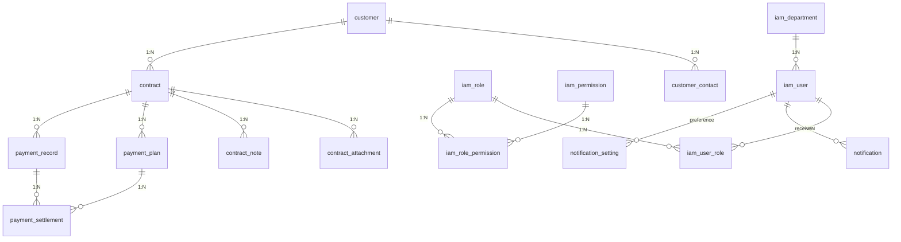

# 数据库 ER 概览

> 详细字段定义见 `db/schema/V1.0.0__init.sql`，本文为模块归属与外键关系的高层视图。

## 模块归属

| 模块 | 表 |
| --- | --- |
| IAM | `iam_user` `iam_role` `iam_permission` `iam_user_role` `iam_role_permission` `iam_department` |
| 客户 | `customer` `customer_contact` |
| 合同 | `contract` `contract_attachment` `contract_note` |
| 回款 | `payment_plan` `payment_record` `payment_settlement` |
| 通知 | `notification` `notification_setting` |
| 系统 | `change_log` `operation_log` `hard_delete_log` `system_param` `file_object` |

## 关键索引

- `customer.uscc` UNIQUE — 防止统一信用代码重复；
- `payment_plan(contract_id, period_no)` UNIQUE — 同合同内期次唯一；
- `notification(receiver_id, scene, biz_id, created_at)` — 用于通知去重查询；
- `operation_log(operator_id, created_at)` 和 `(module, op_type, created_at)` — 审计回溯；
- `contract.perform_end_at` — 到期提醒批处理快速命中。

## 软删除约定

除了 `payment_settlement / iam_user_role / iam_role_permission / operation_log / hard_delete_log / system_param / change_log / iam_permission` 之外，所有表均含 `is_deleted` 字段，由 MyBatis-Plus `@TableLogic` 自动过滤。

## 加密存储字段

| 表 | 字段 | 存储 | 显示 |
| --- | --- | --- | --- |
| `iam_user` | `phone` | AES-256-GCM | `138****1234` |
| `iam_user` | `email` | AES-256-GCM | `z****@x.com` |
| `customer_contact` | `phone` `email` `wechat` | AES-256-GCM | 同上 |
| `payment_record` | `voucher_no` | AES-256-GCM | 仅财务可见明文 |
