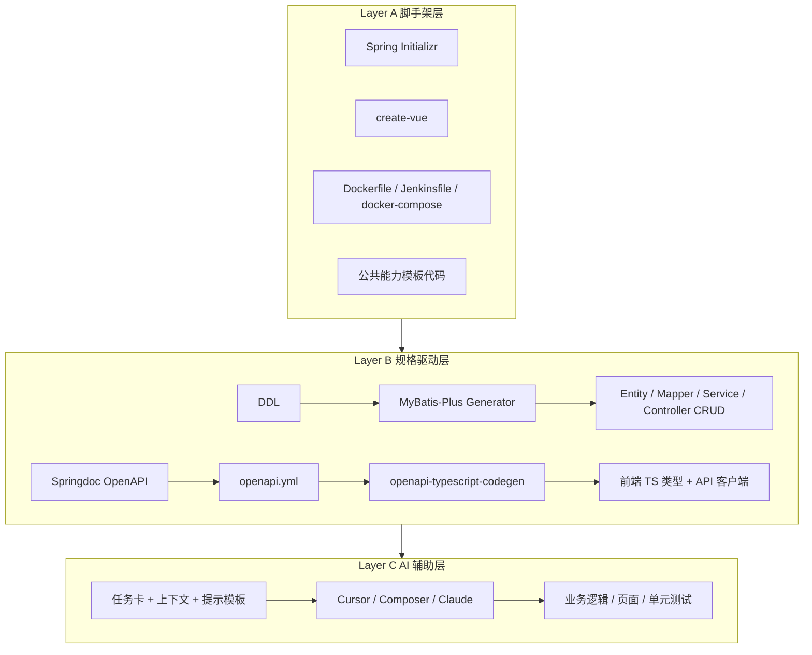
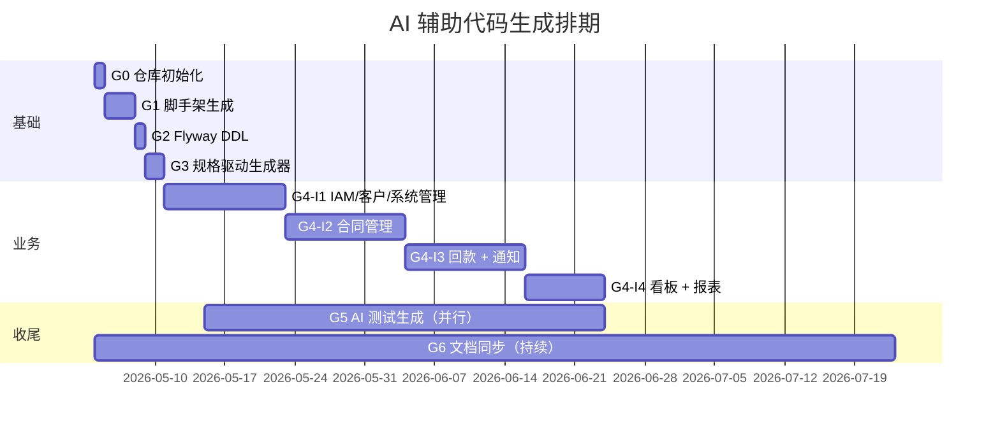

# 代码自动生成计划（CRMS Code Auto-Gen Plan）

> 归档说明：本文档原位于 `~/.cursor/plans/代码自动生成计划_db0fc097.plan.md`（Cursor IDE 计划缓存），2026-05-07 移入仓库 `docs/` 统一管理。
> 计划中 G0–G6 全部 8 个 todo 在归档时已标记为 `completed`，详见正文阶段表。

## 1. 策略总览：三层生成模型



- **Layer A（脚手架）**：一次性、模板化、不变；
- **Layer B（规格驱动）**：从 DDL/OpenAPI 自动生成 CRUD 闭环（占总代码量约 30–40%）；
- **Layer C（AI 辅助）**：复杂业务逻辑、组合页面、测试由 AI 生成，开发者评审调优。

## 2. 仓库结构（最终落地于 `~/Desktop/crms/`）

```
~/Desktop/crms/
├── crms-app/                    # 后端 Spring Boot 工程
│   ├── src/main/java/com/company/crms/
│   │   ├── common/              # 公共：响应/异常/加密/日志 AOP/ID 生成器
│   │   ├── iam/ customer/ contract/ payment/ report/ notification/ system/
│   │   └── CrmsApplication.java
│   ├── src/main/resources/
│   │   ├── application-{local,test,staging,prod}.yml
│   │   └── db/migration/        # Flyway: V1.0.0__init.sql, V1.0.1__seed.sql ...
│   └── pom.xml
├── crms-web/                    # 前端 Vue 3 工程
│   ├── src/api/                 # generated by openapi-typescript-codegen
│   ├── src/views/ components/ stores/ router/ utils/
│   └── package.json
├── db/
│   ├── schema/                  # 与 crms-app/db/migration 一致（双向同步）
│   ├── desensitize/             # 数据脱敏脚本（DSS §10.7）
│   └── erd.md
├── deploy/
│   ├── docker-compose.{test,prod}.yml
│   ├── nginx/
│   ├── Jenkinsfile
│   └── scripts/                 # check_disk.sh / check_app.sh / backup.sh
├── docs/                        # 软链接桌面三件套
│   ├── srs.md → ~/Desktop/合同回款管理系统-需求说明书.md
│   ├── dss.md → ~/Desktop/合同回款管理系统-开发规格说明书.md
│   └── tasks.md → ~/Desktop/合同回款管理系统-开发任务拆分.md
├── prompts/                     # AI 提示词模板（核心产物）
│   ├── system-backend.md
│   ├── system-frontend.md
│   ├── task-template.md
│   └── examples/
├── .gitignore .editorconfig README.md
```

## 3. 工具链选型

| 层级 | 工具 | 用途 | 备注 |
| --- | --- | --- | --- |
| 脚手架 | Spring Initializr | 后端骨架 | 一次性 |
| 脚手架 | `pnpm create vue@latest` | 前端骨架 | 一次性 |
| 规格驱动 | **MyBatis-Plus Generator 3.5+** | DDL → Entity/Mapper/Service/Controller | 自定义模板覆盖默认 |
| 规格驱动 | **Springdoc-openapi 2.x** | 注解 → openapi.yml | 实时同步 |
| 规格驱动 | **openapi-typescript-codegen** | openapi.yml → TS 类型 + Axios 客户端 | 前端 |
| 规格驱动 | **Flyway** | DDL 版本化 | `db/migration` |
| AI 辅助 | **Cursor Composer / Claude / GPT** | 业务代码、页面、测试 | 配合提示词模板 |
| 质量 | Checkstyle + ESLint + Vitest + JUnit | 静态扫描 + 测试 | 强制 |

## 4. 六阶段生成流程

### Phase G0 — 仓库与脚手架初始化（1 天）
- 创建 `~/Desktop/crms/` 与子目录；
- `git init`；编写顶层 `README.md`、`.gitignore`、`.editorconfig`；
- 把桌面三份说明书软链到 `docs/`。

### Phase G1 — Layer A 脚手架生成（2–3 天）
**G1.1 后端骨架**
- 通过 Spring Initializr 生成（Java 17, Boot 3.2，依赖：Web、Validation、MyBatis-Plus、Sa-Token、Redis、MinIO Client、Flyway、Lombok、Springdoc）；
- 落地 [crms-app/src/main/java/com/company/crms/common](../crms-app/src/main/java/com/company/crms/common) 公共能力（手工 + 模板）：
  - `Result<T>`、`PageResult<T>`、`BizException`、`ErrorCode` enum；
  - `GlobalExceptionHandler`（@RestControllerAdvice）；
  - `AesCryptoUtil`（AES-256-GCM）+ 字段加密注解 `@SensitiveField`；
  - `SnowflakeIdGenerator`、`CodeGenerator`（Redis Lua）；
  - `OperationLogAspect`（`@OperationLog` 注解）；
  - `DataScopeInterceptor`（MyBatis-Plus 拦截器）。
- 配置文件：`application-{env}.yml`、`logback-spring.xml`。

**G1.2 前端骨架**
- `pnpm create vue@latest crms-web`（TS + Pinia + Router + ESLint + Prettier + Vitest）；
- 安装 Element Plus、Axios、ECharts、`openapi-typescript-codegen`、`unplugin-auto-import`；
- 落地 `src/`：
  - `api/http.ts`（Axios 拦截器）；
  - `stores/auth.ts`、`stores/dict.ts`；
  - `router/index.ts` + 动态路由 + `v-perm` 指令；
  - `layouts/MainLayout.vue`、`views/login/LoginView.vue`、`views/error/`。

**G1.3 DevOps 脚手架**
- [crms-app/Dockerfile](../crms-app/Dockerfile)（按 DSS §10.3 模板）；
- [deploy/docker-compose.test.yml](../deploy/docker-compose.test.yml) + 生产版；
- [deploy/Jenkinsfile](../deploy/Jenkinsfile)（按 DSS §10.4.3 骨架）；
- [deploy/scripts/](../deploy/scripts/) cron 巡检脚本与备份脚本。

**对应任务**：覆盖任务拆分中的 P0-BE-001/002/003、P0-FE-001/002/003、P0-OP-001~006。

### Phase G2 — Flyway DDL 与种子数据（0.5 天）

- 将 DSS §4.3 的 DDL 整理为：
  - [crms-app/src/main/resources/db/migration/V1.0.0__init.sql](../crms-app/src/main/resources/db/migration/V1.0.0__init.sql)：20 张表全量；
  - `V1.0.1__seed_permissions.sql`：内置 5 角色 + 权限点；
  - `V1.0.2__seed_dict_and_admin.sql`：字典枚举 + 默认超管账号；
  - `V1.0.3__seed_system_param.sql`：8 个系统参数初值（DSS §4.4）。
- 启动 `crms-app` 一次确保 Flyway 迁移成功；产出实际表结构。

**对应任务**：P0-DB-001、P0-DB-002。

### Phase G3 — Layer B 规格驱动生成（1–2 天）

**G3.1 MyBatis-Plus Generator 配置**
- 编写 [crms-app/scripts/generate-code.java](../crms-app/scripts/generate-code.java) 脚本（一次性）：
  - 读取数据库表清单；
  - 生成 Entity（含 `@TableLogic` 软删、`@Version` 乐观锁、加密字段标注）；
  - 生成 Mapper、Service、ServiceImpl、Controller 基础 CRUD；
  - 自定义 Velocity 模板，强制使用 `Result<T>` 与统一异常；
  - 输出到 `src/main/java/com/company/crms/<module>/`。
- **预期产出**：约 20 张表 × 5 类文件 ≈ 100 个文件，覆盖 30–40% 后端代码量。

**G3.2 OpenAPI 自动同步**
- 在 Controller 上添加 `@Tag`、`@Operation`、`@Schema` 注解；
- Springdoc 自动产出 `http://localhost:8080/v3/api-docs`；
- CI 阶段导出为 [docs/openapi.yml](./openapi.yml)。

**G3.3 前端 API 客户端生成**
- 配置 `openapi-typescript-codegen`：

```json
  // crms-web/package.json scripts
  "gen:api": "openapi --input ../docs/openapi.yml --output src/api/generated --useOptions"
```

- 每次后端接口变更后跑一次 `pnpm gen:api`，得到全量 TS 类型与 Axios 调用。

**对应任务**：覆盖大部分 `I*-CT-001/002`、`I1-CU-001/002`、`I3-PP-001`、`I3-PR-001` 等 CRUD 部分（约 30 个任务的基础工作）。

### Phase G4 — Layer C AI 辅助业务代码（按迭代推进）

**G4.1 提示词模板体系**
建立 `prompts/` 目录，包含：
- `system-backend.md`：技术栈、命名规范、统一响应、异常处理、加密、数据范围、AOP 用法；
- `system-frontend.md`：Vue 3 Composition API、Element Plus 用法、API 调用约定、UI 规范；
- `task-template.md`：单任务提示模板，由开发者填空：

```
  ## 上下文
  - 任务：{{任务卡 markdown}}
  - 依赖代码（已存在）：{{相关文件路径与摘要}}
  - 关联 SRS UC：{{UC 编号 + 原文}}
  - 关联 DSS 章节：{{§x.y 摘要}}
  - 数据库表：{{表 DDL}}

  ## 要求
  1. 按 system-{backend,frontend}.md 规范实现
  2. 输出：业务代码 + 单元测试 + OpenAPI 注解
  3. 不要创建已存在的文件，仅追加/修改
  4. 关键决策点列在代码注释外，便于评审
```

- `examples/`：放 1–2 个完整示例（含输入提示与输出代码），供新成员对齐风格。

**G4.2 按迭代生成（与任务拆分一一对应）**



每个迭代内的执行节奏：
1. 后端先行：横切能力 → 实体扩展 → Service 业务方法 → Controller 业务接口 → 单元测试；
2. 前端跟进：API client（自动生成） → Pinia store → 列表/表单/详情页面 → E2E；
3. 每完成一个高内聚任务（如"客户合并"）做一次小范围 Code Review；
4. 双周 demo + 缺陷批量修复。

**G4.3 复杂逻辑专项**
以下 5 个高复杂度任务采用"先伪代码评审 → AI 生成 → 多轮调优"模式：
- I3-PR-002 自动核销算法（DSS §3.4.1）；
- I3-PR-004 红冲（DSS §3.4.2）；
- I3-PR-006 Excel 批量导入；
- I1-CU-005 客户合并（DSS §3.2.1）；
- I1-CM-002 数据范围拦截器（DSS §3.1.2）。

### Phase G5 — AI 测试生成（与 G4 并行）
- 单元测试：每个 Service 方法生成正常路径 + 至少 2 条异常路径；
- 集成测试：使用 Testcontainers + Spring Boot Test，对 Mapper、Controller 做端到端；
- E2E：Playwright 关键链路（登录 → 新建客户 → 新建合同 → 登记回款 → 看板）。
- 强制 DOD：覆盖率 ≥ 80%，关键模块（核销、合并、硬删除）≥ 95%。

### Phase G6 — 文档与持续生成（持续进行）
- OpenAPI 每次迭代结束后导出 `docs/openapi.yml`；
- README 自动汇总：模块清单、API 总数、覆盖率徽章；
- 数据脱敏脚本（DSS §10.7）在 G4-I3 结束后产出 [db/desensitize/desensitize.sql](../db/desensitize/desensitize.sql) 与 [db/desensitize/run.sh](../db/desensitize/run.sh)。

## 5. 任务到生成阶段的映射

| 任务拆分阶段 | 任务数 | 生成方式 | 自动化比例（预估） |
| --- | --- | --- | --- |
| 阶段 0（18） | 18 | A 脚手架 + 手工 | 70% |
| 迭代 1（32） | 32 | A + B（CRUD）+ C（业务） | 60% |
| 迭代 2（24） | 24 | B（CRUD）+ C（状态机/附件） | 55% |
| 迭代 3（28） | 28 | B（CRUD）+ C（核销/红冲/通知） | 45% |
| 迭代 4（16） | 16 | C（聚合查询、看板） | 65% |
| 测试 + UAT（14） | 14 | C（AI 生成测试 + 手工 UAT） | 50% |
| 上线 + 试运行（9） | 9 | A（脚本）+ 手工 | 30% |
| 跨阶段（11） | 11 | 手工为主 | 20% |
| **加权平均** | 152 | — | **约 50%** |

> 50% 自动化的含义：原始 226 人天估算可压缩到约 130–150 人天（含 AI 评审与调优时间）；折合工期可缩短至 12–14 周（vs 原 19 周）。

## 6. 质量保障与防滑

| 风险 | 防滑措施 |
| --- | --- |
| AI 生成代码风格不一 | 提示词中强制加载 `prompts/system-*.md` + 提供 1 个完整 example |
| 复杂业务（核销/合并）一次到位难 | 先评审伪代码 → 再生成代码；强制单测覆盖率 ≥ 95% |
| AI 不知道已有代码上下文 | Cursor 中按需 `@filename` 引用；老人新人都用同一个 prompts 模板 |
| 生成代码安全漏洞 | 沿用 DSS §7.5 漏洞防护清单；每个 PR 强制安全自检勾选 |
| 数据范围越权 | 集成测试覆盖三种角色 + IDOR 用例 |
| OpenAPI 与代码漂移 | CI 中加 `gen:api` 比对，产生 diff 即失败 |
| Flyway 历史脚本被改 | CI 校验已发布版本号文件 hash |

## 7. 立即可执行的下一步

1. 创建仓库 `~/Desktop/crms/` 并完成 G0；
2. 起 Layer A 后端（Spring Initializr 在线配置 + 下载到 `crms-app/`）；
3. 起 Layer A 前端（`pnpm create vue@latest`）；
4. 把 DSS §4.3 的 DDL 拷贝到 `V1.0.0__init.sql`，跑一次 Flyway；
5. 配置 MyBatis-Plus Generator 跑出 CRUD；
6. 写 `prompts/system-backend.md` 与 `prompts/system-frontend.md`；
7. 选择第一个迭代 1 任务（建议 `I1-IAM-004` Sa-Token 集成 或 `I1-CU-001~002` 客户 CRUD）作为 AI 辅助首单进行验证。

## 8. 计划交付物

- 本计划本身（已提交，等待你确认）；
- 后续将顺序产出：
  - `~/Desktop/crms/` 完整仓库；
  - `prompts/` 提示词模板套件；
  - 数据库 Flyway 脚本（V1.0.0~V1.0.3）；
  - MyBatis-Plus Generator 自定义模板；
  - OpenAPI 与前端 API 客户端生成命令；
  - 第一批迭代 1 业务代码（验证可行性）。

---

## 9. 待确认问题（执行前最后一轮对齐）

| 编号 | 议题 | 影响 |
| --- | --- | --- |
| G-Q1 | Java 包名前缀使用 `com.company.crms` 还是公司实际域名？ | 全局 import 路径 |
| G-Q2 | 数据库连接默认参数：MySQL 版本（8.0.x）、字符集（utf8mb4）、root 密码占位符策略？ | 环境配置 |
| G-Q3 | 是否需要把 `~/Desktop/crms/` 推到远端 Git（GitHub/Gitee/公司 GitLab）？ | CI/CD 接入 |
| G-Q4 | 加密密钥（AES-256）首次值由你提供，还是脚手架生成随机值放入 `.env.example`？ | 安全合规 |
| G-Q5 | AI 辅助生成过程中，是否优先使用 Cursor Composer（流程）还是逐文件 Claude 对话（细粒度）？ | 工作流 |

> 默认值（已采纳）：G-Q1 用 `com.company.crms`、G-Q2 标准默认、G-Q3 暂不推送、G-Q4 脚手架生成 `.env.example` 模板、G-Q5 Cursor Composer 主导 + Claude 配合。
